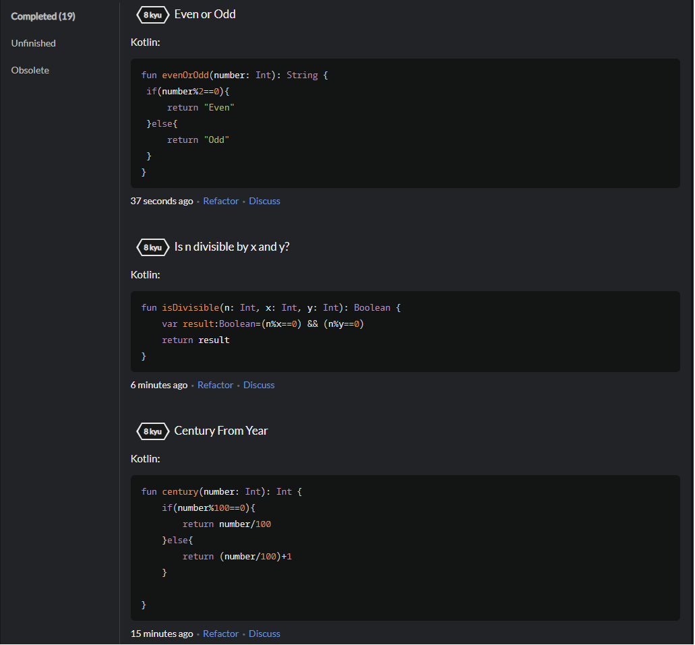
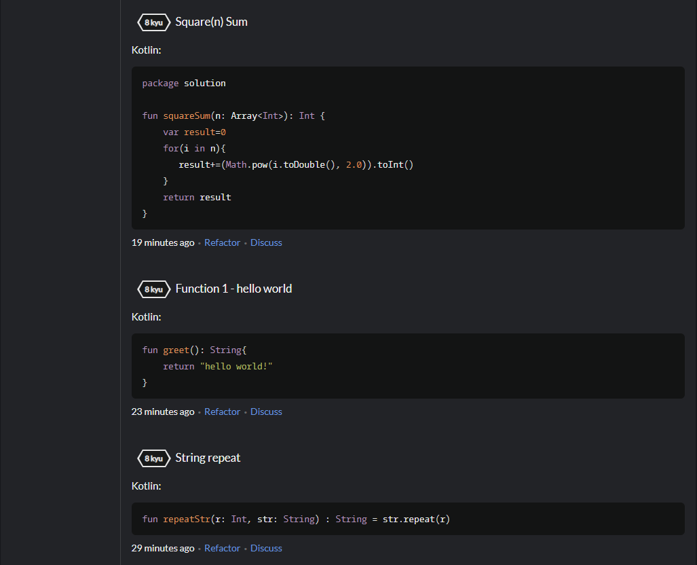
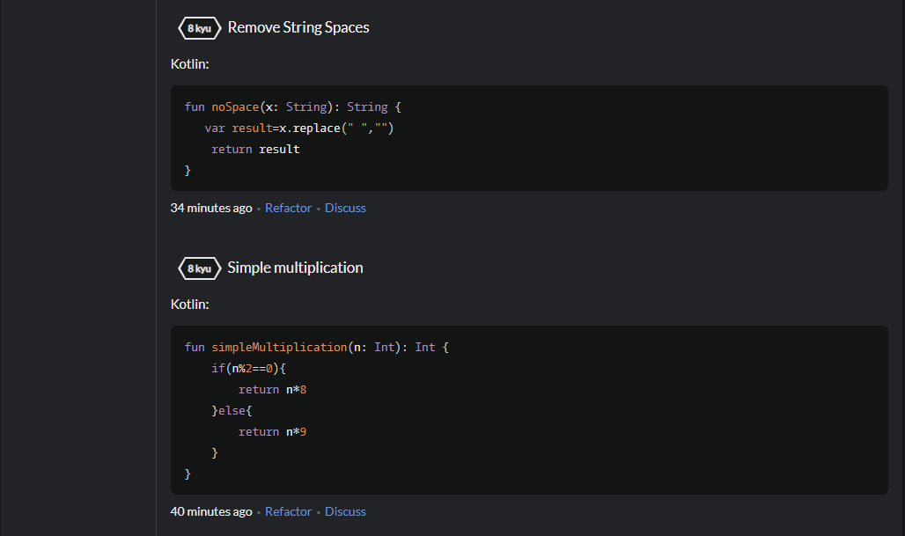

МИНИСТЕРСТВО НАУКИ И ВЫСШЕГО ОБРАЗОВАНИЯ
РОССИЙСКОЙ ФЕДЕРАЦИИ
ФЕДЕРАЛЬНОЕ ГОСУДАРСТВЕННОЕ БЮДЖЕТНОЕ
ОБРАЗОВАТЕЛЬНОЕ УЧРЕЖДЕНИЕ ВЫСШЕГО ОБРАЗОВАНИЯ
«САХАЛИНСКИЙ ГОСУДАРСТВЕННЫЙ УНИВЕРСИТЕТ»

      

Институт естественных наук и техносферной безопасности Кафедра информатики Чагочкин Никита

   

Лабораторная работа №5 «Вторая activity». 01.03.02 Прикладная математика и информатика

            

Научный руководитель 
Соболев Евгений Игоревич

   

г. Южно-Сахалинск 2023 г.

***
# 
1. Лазейка для читера  

Мошенники никогда не выигрывают... Если, конечно, им не удастся обойти вашу защиту от мошенничества. А скорее всего, они так и сделают — именно потому, что они мошенники. У GeoQuiz есть кое-какая лазейка. Пользователи могут вращать CheatActivity после чита, чтобы удалить следы обмана. После возврата к MainActivity их жульничество будет забыто. Исправьте эту ошибку, сохраняя состояние пользовательского интерфейса CheatActivity во время вращения и после уничтожения процесса.
***
## 
Решение

Для исправления данной уязвимости я добавил переменную, где буду хранить состояние о том, воспользовался пользователь читом или нет

         private var shownAnswer=false

Эта переменная и значение answerTextView будут сохранятся 

         override fun onSaveInstanceState(outState: Bundle) {
                outState?.run {
                    putBoolean(KEY,shownAnswer)
                    putString(ANSWER_KEY,answerTextView.text.toString())
                }
                super.onSaveInstanceState(outState)

            }

При вызове функции onStart значения shownAnswer и answerTextView будут браться из уже сохраненных, и будет вызвана функция setAnswerShownResult, для определения возвращаемого значения в первую Activity

        override fun onCreate(savedInstanceState: Bundle?) {
    
            shownAnswer = savedInstanceState?.getBoolean(KEY, false) ?: false
            answerTextView.text=savedInstanceState?.getString(ANSWER_KEY,"")
            setAnswerShownResult(shownAnswer)

# 
2.Отслеживание читов по вопросу 

В настоящее время, когда пользователь читерит на одном вопросе, он считается читером по всем вопросам. Обновите GeoQuiz, чтобы отслеживать, сколько раз пользователь нарушал закон. Когда пользователь использует чит для ответа на заданный вопрос, осуждайте его всякий раз, когда он пытается ответить на этот вопрос. Когда пользователь отвечает на вопрос, с которым он не жульничал, покажите правильный или неправильный ответ.
***
## 
Решение

В классе Question я добавил еще одно поле usedCheat

        data class Question(@StringRes val textResId: Int, val answer: Boolean, var enableButton:Boolean=true,var usedCheat:Boolean=false)

Переписал функцию onActivityResult в MainActivity, которая принимает результат от cheatActivity, теперь она будет изменять поле usedCheat у элементов из массива с вопросами

        override fun onActivityResult(requestCode: Int,
                                        resultCode: Int,
                                        data: Intent?) {
                super.onActivityResult(requestCode, resultCode, data)
                if (resultCode != Activity.RESULT_OK) {
                    return
                }
                if (requestCode == REQUEST_CODE_CHEAT) {
                    quizViewModel.questionBank[quizViewModel.currentIndex].usedCheat  =
                        data?.getBooleanExtra(EXTRA_ANSWER_SHOWN, false) ?: false
                }
            }

Добавил проверку на использование читов при нажатии на кнопки True False

        true_button.setOnClickListener {
                    if(quizViewModel.questionBank[quizViewModel.currentIndex].usedCheat==false) {
                        checkAnswer(true)
                        quizViewModel.FalsedEnableButton()
                        true_button.setEnabled(quizViewModel.currentQuestionEnableButton)
                        false_button.setEnabled(quizViewModel.currentQuestionEnableButton)
                        ShowAnswer()
                    }
                    else{
                        Toast.makeText(this, R.string.judgment_toast, Toast.LENGTH_SHORT)
                            .show()
                    }
                }

        false_button.setOnClickListener {
            if(quizViewModel.questionBank[quizViewModel.currentIndex].usedCheat==false) {
                checkAnswer(false)
                quizViewModel.FalsedEnableButton()
                true_button.setEnabled(quizViewModel.currentQuestionEnableButton)
                false_button.setEnabled(quizViewModel.currentQuestionEnableButton)
                ShowAnswer()
            }
            else{
                Toast.makeText(this, R.string.judgment_toast, Toast.LENGTH_SHORT)
                    .show()
            }
        }

## 
CodeWars

## [Ссылка на профиль Codewars](https://www.codewars.com/users/NoToxic)

